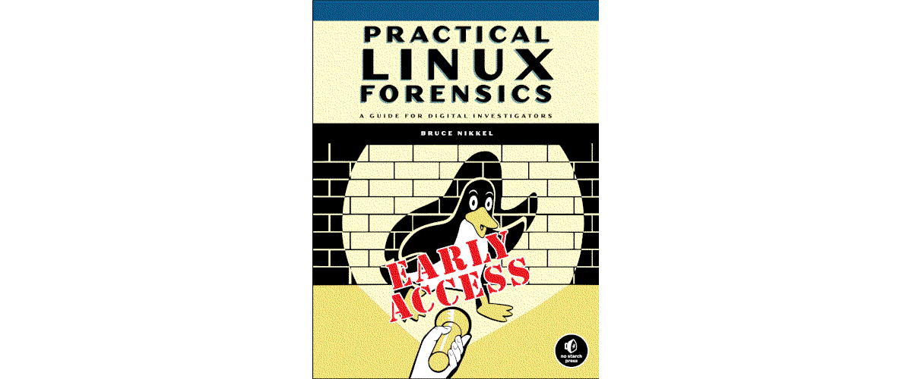

# Using bootable recovery media

The concept of live media is a wonderful thing, as we can boot into a completely different working
environment from the operating system installed on our device and perform tasks without disrupting
installed software on the host system. The desktop version of Ubuntu, for example, offers a complete
computing environment we can use in order to not only test hardware and troubleshoot our systems
but also browse the web just as we would on an installed system. In terms of recovering from disasters, live media becomes a saving grace.

Ubuntu’s live media is great, and it doesn’t work for absolutely everything. Tools such as Clonezilla specialize in working with hard disks.

|  |
|:--:|
| [Practical Linux Forensics, Bruce Nikkel, 2021](https://nostarch.com/practical-linux-forensics) |

