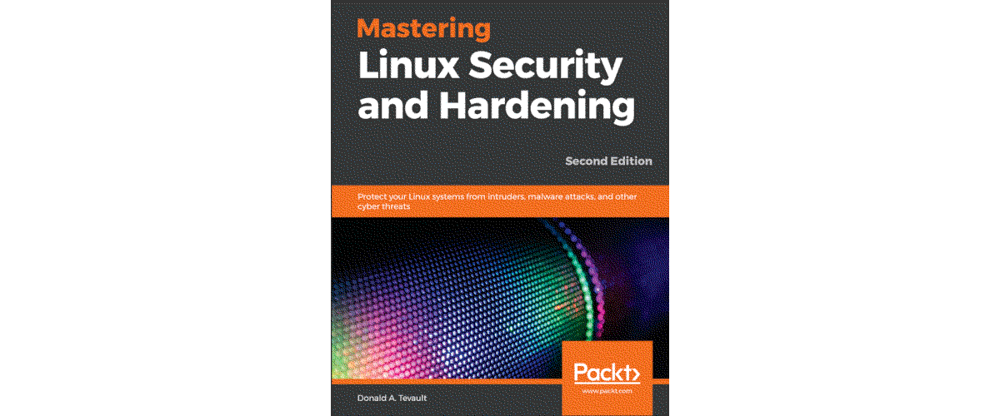

# Introduction

## What?

Never have anything that you don't absolutely need installed on a server. Especially not any unnecessary network services.

## Why?

Do not give adversaries extra ways to get into the systems.

## How?

* [Auditing system services with systemctl](systemctl.md)
* [Auditing network services with netstat](netstat.md)
* [Auditing network services with nmap](nmap.md)

----

|  |
|:--:|
| [Mastering Linux Security and Hardening, Donald A. Tevault, Second Edition](https://www.packtpub.com/product/mastering-linux-security-and-hardening-second-edition/9781838981778) |