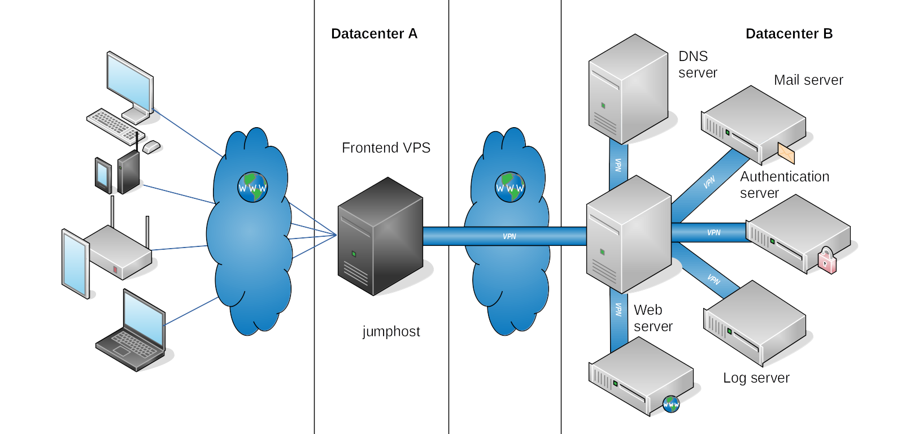
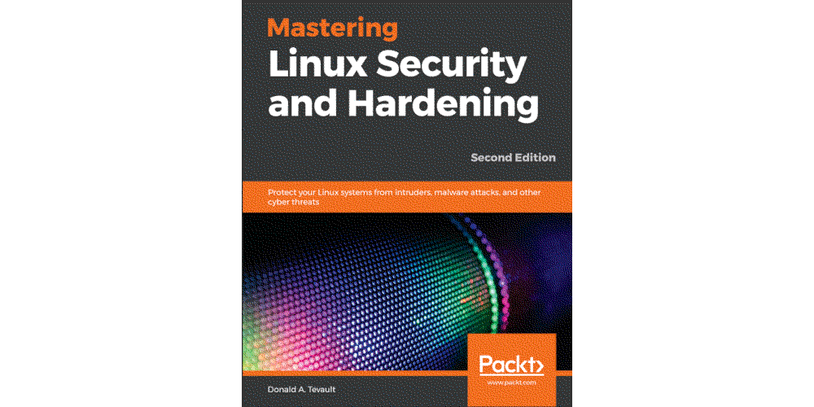

Hardening Linux server
====================================================

----

The below writeups were initially based on debian 9 hosts, and then later on ubuntu 18.04 LTS. Everything that applies
to those two will probably also apply to newer versions and other distributions. More or less. If something does not work, check the documentation
for that distro and/or version for what you are trying to do.

----

.. toctree::
   :glob:
   :maxdepth: 1
   :includehidden:
   :caption: Securing user accounts

   docs/users/README.md
   docs/users/sudo.md
   docs/users/disable-root.md
   docs/users/homes.md
   docs/users/passwords.md
   docs/users/other-reqs.md
   docs/users/lxd.md

.. toctree::
   :glob:
   :maxdepth: 1
   :includehidden:
   :caption: Services

   docs/services/README.md
   docs/services/services.md

.. toctree::
   :glob:
   :maxdepth: 1
   :includehidden:
   :caption: SSH

   docs/ssh/README.md
   docs/ssh/install-ssh.md
   docs/ssh/harden-ssh.md
   docs/ssh/key-management.md
   docs/ssh/jumping.md

.. toctree::
   :glob:
   :maxdepth: 1
   :includehidden:
   :caption: VPN

   docs/vpn/README.md
   docs/vpn/*

.. toctree::
   :glob:
   :maxdepth: 1
   :includehidden:
   :caption: VNC

   docs/vnc/README.md
   docs/vnc/TigerVNC.md
   docs/vnc/TightVNC.md
   docs/vnc/secure-sessions.md

.. toctree::
   :glob:
   :maxdepth: 1
   :includehidden:
   :caption: Public key infrastructure (PKI)

   docs/pki/README.md
   docs/pki/problems.md
   docs/pki/internal-pki.md
   docs/pki/pam.md
   docs/pki/lets-encrypt.md
   docs/pki/tls-ssl.md

.. toctree::
   :glob:
   :maxdepth: 1
   :includehidden:
   :caption: Logfiles

   docs/logfiles/README.md
   docs/logfiles/rsyslogd.md
   docs/logfiles/log-commands
   docs/logfiles/intruder-path.md
   docs/logfiles/rotate.md
   docs/logfiles/centralised.md

.. toctree::
   :glob:
   :maxdepth: 1
   :includehidden:
   :caption: Backup

   docs/backups/README.md
   docs/backups/*

.. toctree::
   :glob:
   :maxdepth: 1
   :includehidden:
   :caption: Firewall

   docs/firewall/README.md
   docs/firewall/iptables.md
   docs/firewall/nftables.md
   docs/firewall/firewalld.md
   docs/firewall/firehol.md
   docs/firewall/ufw.md
   docs/firewall/pf.md
   docs/firewall/fail2ban.md
   docs/firewall/sshguard.md
   docs/firewall/waf.md
   docs/firewall/port-spoofing.md

.. toctree::
   :glob:
   :maxdepth: 1
   :includehidden:
   :caption: Guards! Guards!

   docs/ids/README.md
   docs/ids/samhain.md
   docs/ids/*

.. toctree::
   :glob:
   :maxdepth: 1
   :includehidden:
   :caption: Troubleshooting

   docs/trouble/README.md
   docs/trouble/*

.. toctree::
   :caption: Links

   Blue Team <https://blue.tymyrddin.dev/>

----

Wishlist: server configurations for a separate authentication server, log server, and DNS server, and a
Maltrail firewall implemented on the Bastion jumpserver.

